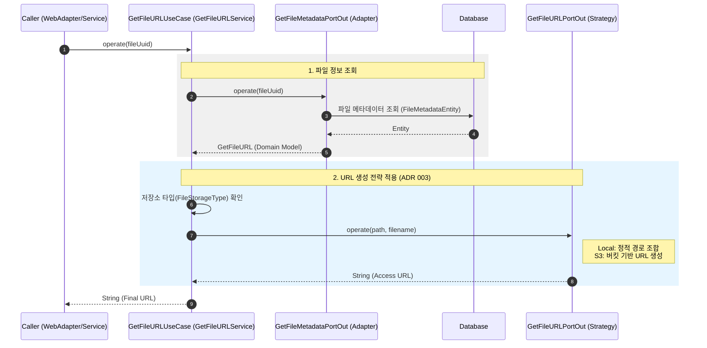

# 파일 URL 조회 유스케이스 시퀀스 다이어그램 (Get File URL Sequence)

이 다이어그램은 파일의 UUID를 기반으로 저장소 위치를 확인하고, 각 저장소 기술에 맞는 접근 URL(Static URL, S3 URL 등)을 동적으로 생성하는 과정을 보여줍니다.

## 주요 단계 및 특징

1.  **메타데이터 기반**: 파일의 물리적 경로뿐만 아니라 저장소 타입(S3, Local 등)을 DB에서 먼저 읽어와야 정확한 URL 형식을 결정할 수 있습니다.
2.  **전략 패턴(Strategy Pattern)**: 저장소마다 URL을 만드는 규칙이 다르므로(예: 도메인 주소, 환경 설정 등), `GetFileURLPortOut`의 다형성을 활용하여 서비스 로직을 단순하게 유지합니다.
3.  **내부 호출 지원**: 이 유스케이스는 웹 컨트롤러뿐만 아니라 `UploadFileWebAdapter`처럼 다른 작업 성공 후 결과 URL을 즉시 반환해야 할 때 내부적으로도 자주 참조됩니다.
