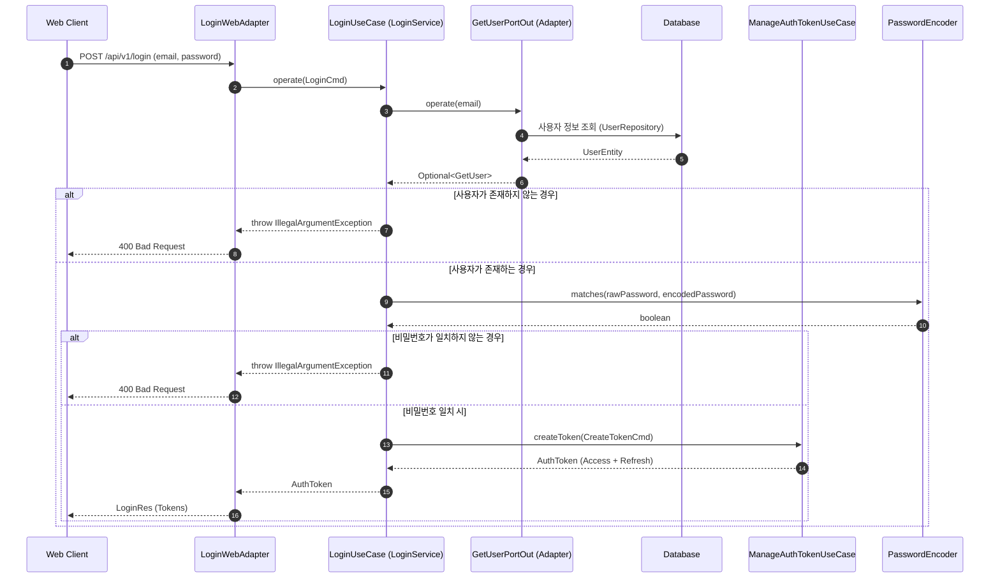

# 로그인 유스케이스 시퀀스 다이어그램 (Login Sequence)

로그인 과정은 사용자의 자격 증명을 검증하고, 성공 시 JWT 토큰을 발급하는 과정을 포함합니다.

## 주요 단계 설명

1.  **자격 증명 수신**: `LoginWebAdapter`가 HTTP 요청을 받아 `LoginCmd`로 변환하여 유스케이스에 전달합니다.
2.  **사용자 조회**: `GetUserPortOut`을 통해 영속성 계층에서 해당 이메일의 사용자 정보를 가져옵니다.
3.  **비밀번호 검증**: `PasswordEncoder`를 사용하여 해시된 비밀번호와 입력된 비밀번호를 안전하게 비교합니다.
4.  **토큰 발급**: 인증이 성공하면 `ManageAuthTokenUseCase`에 의뢰하여 새로운 JWT 세트를 생성합니다.
5.  **결과 반환**: 최종적으로 생성된 토큰을 클라이언트에게 응답합니다.
