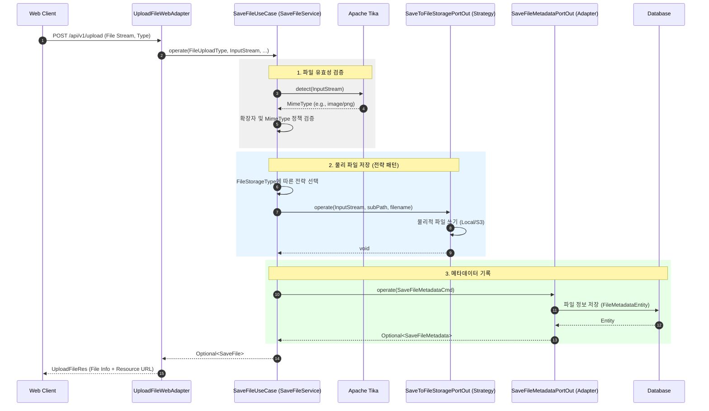

# 파일 저장 유스케이스 시퀀스 다이어그램 (Save File Sequence)

이 다이어그램은 클라이언트로부터 전달된 파일 스트림을 검증하고, 설정된 전략에 따라 물리 저장소와 DB에 기록하는 전체 과정을 보여줍니다.

## 주요 단계 및 특징

1.  **콘텐츠 기반 검증**: 파일 확장자뿐만 아니라 `Apache Tika`를 사용하여 실제 파일의 바이너리(Magic Bytes)를 분석함으로써 보안성을 높입니다.
2.  **전략 패턴 적용**: `FileUploadType`에 설정된 `FileStorageType`에 따라 로컬 저장소 혹은 S3 저장소 전략이 실시간으로 선택되어 실행됩니다.
3.  **데이터 정합성**: 물리적인 파일 저장이 성공한 직후에만 DB 메타데이터를 기록하여, 유효하지 않은 파일 정보가 DB에 남지 않도록 보장합니다.
4.  **추상화**: 서비스 레이어는 파일이 실제로 하드디스크에 써지는지 S3에 전송되는지 알 필요가 없으며, 오직 `Port` 인터페이스와 소통합니다.
