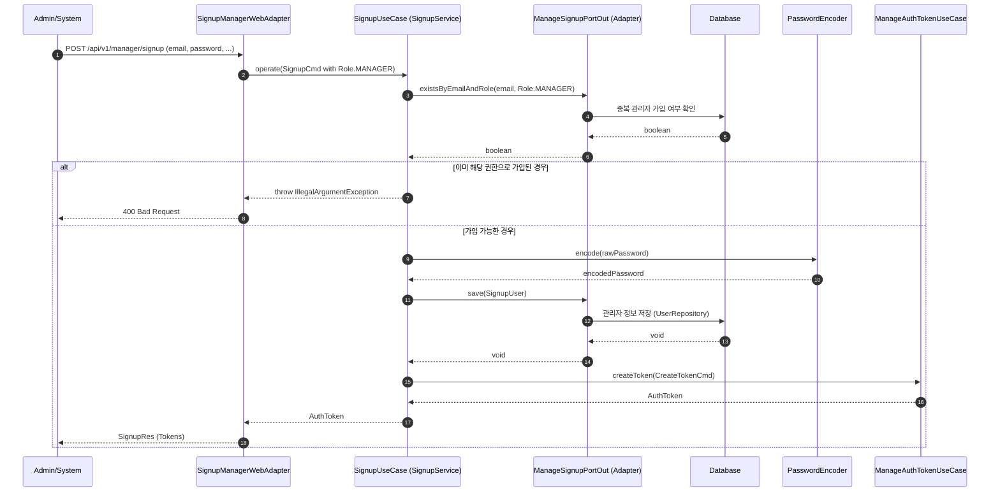

# 관리자 회원가입 시퀀스 다이어그램 (Manager Signup Sequence)

이 다이어그램은 시스템 관리자(MANAGER) 계정을 생성하는 과정을 보여줍니다. 내부적으로는 일반 사용자 가입과 동일한 `SignupUseCase`를 사용하며, 어댑터 레벨에서 권한을 결정합니다.

## 주요 단계 및 특징

1.  **권한 고정**: `SignupManagerWebAdapter`는 요청 데이터와 상관없이 `Role.MANAGER`를 강제로 할당하여 유스케이스를 호출합니다.
2.  **중복 체크**: 동일한 이메일이라도 권한(Role)이 다르면 가입이 가능하도록 `existsByEmailAndRole`을 통해 정교하게 체크합니다. (비즈니스 정책에 따름)
3.  **암호화 및 저장**: 관리자의 비밀번호 역시 안전하게 암호화되어 저장됩니다.
4.  **자동 로그인**: 가입 성공 즉시 관리자 권한을 가진 토큰을 발급하여 관리자 페이지 접근 권한을 부여합니다.
