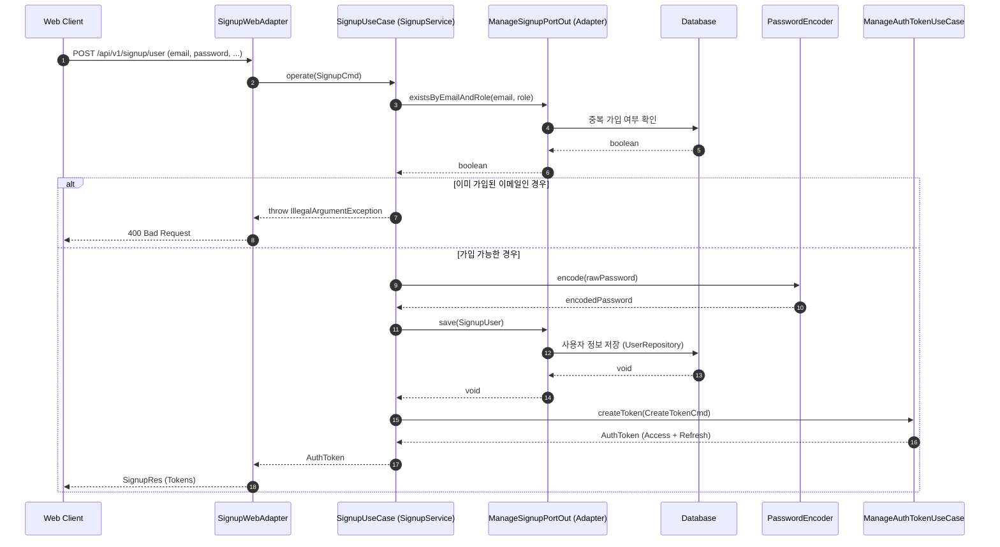

# 회원가입 유스케이스 시퀀스 다이어그램 (Signup Sequence)

회원가입 과정은 중복 이메일 체크, 비밀번호 암호화, 사용자 정보 저장 및 가입 즉시 로그인을 위한 토큰 발급 과정을 포함합니다.

## 주요 단계 설명

1.  **중복 가입 검증**: `ManageSignupPortOut`을 통해 요청된 이메일과 권한(Role)이 이미 존재하는지 확인하여 중복 가입을 방지합니다.
2.  **보안 강화**: `PasswordEncoder`를 사용하여 비밀번호를 평문으로 저장하지 않고 안전하게 암호화합니다.
3.  **영속화**: 암호화된 비밀번호와 사용자 정보를 DB에 저장합니다. 이 과정은 `@Transactional`로 묶여 있어 전체 과정의 원자성을 보장합니다.
4.  **자동 로그인 처리**: 사용자 편의를 위해 가입 완료 직후 `ManageAuthTokenUseCase`를 호출하여 인증 토큰을 발급합니다.
5.  **응답**: 발급된 토큰과 함께 성공 응답을 클라이언트에 전달합니다.
