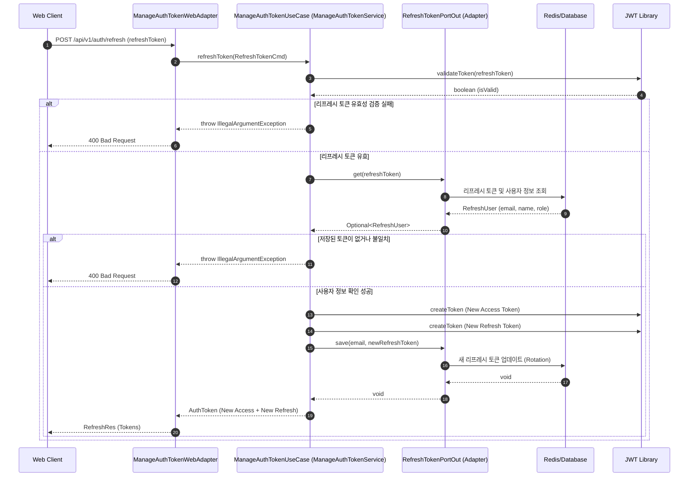

# 토큰 갱신 시퀀스 다이어그램 (Token Refresh Sequence)

액세스 토큰이 만료되었을 때, 리프레시 토큰을 사용하여 새로운 액세스 토큰과 리프레시 토큰 세트를 발급받는 과정입니다.

## 주요 단계 설명

1.  **토큰 검증**: 클라이언트가 보낸 리프레시 토큰 자체의 서명 및 만료 여부를 1차적으로 확인합니다.
2.  **저장소 확인**: 서버 측 저장소(`RefreshTokenPortOut`)에 해당 리프레시 토큰이 실제로 유효하게 등록되어 있는지 확인합니다. 이를 통해 탈취된 토큰의 강제 무효화 등이 가능합니다.
3.  **토큰 회전(Rotation)**: 보안 강화를 위해 액세스 토큰뿐만 아니라 리프레시 토큰도 새로 발급하여 저장소에 업데이트합니다.
4.  **결과 반환**: 새롭게 발급된 토큰 세트를 클라이언트에게 전달하여 세션을 연장합니다.
