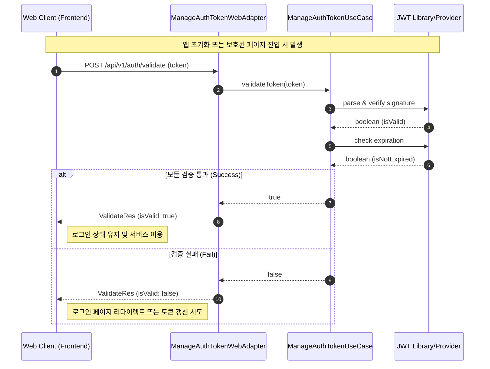

# 토큰 검증 시퀀스 다이어그램 (Token Validation Sequence)

클라이언트가 보유한 액세스 토큰의 유효성(서명 일치, 만료 여부 등)을 명시적으로 확인하는 과정입니다. 이 API는 주로 프론트엔드의 세션 유지 판단이나 라우트 가드에서 사용됩니다.

## 주요 단계 설명

1.  **검증 요청**: 클라이언트(SPA 등)가 보관 중인 액세스 토큰의 유효성을 묻습니다.
2.  **서명 확인**: `ManageAuthTokenUseCase`는 시스템의 Secret Key를 사용하여 토큰이 변조되지 않았는지 확인합니다.
3.  **만료 체크**: 토큰의 `exp` 클레임을 확인하여 현재 시간 기준으로 만료되었는지 판단합니다.
4.  **결과 반환**: 단순히 유효 여부(`true/false`)를 반환하여 클라이언트가 이후 UI 흐름을 결정할 수 있게 합니다.

## 활용 사례
- **페이지 진입 제어**: 관리자 페이지 진입 전 토큰 유효성 선제적 체크.
- **백그라운드 세션 체크**: 앱 실행 중 주기적으로 로그인 상태가 살아있는지 확인.
